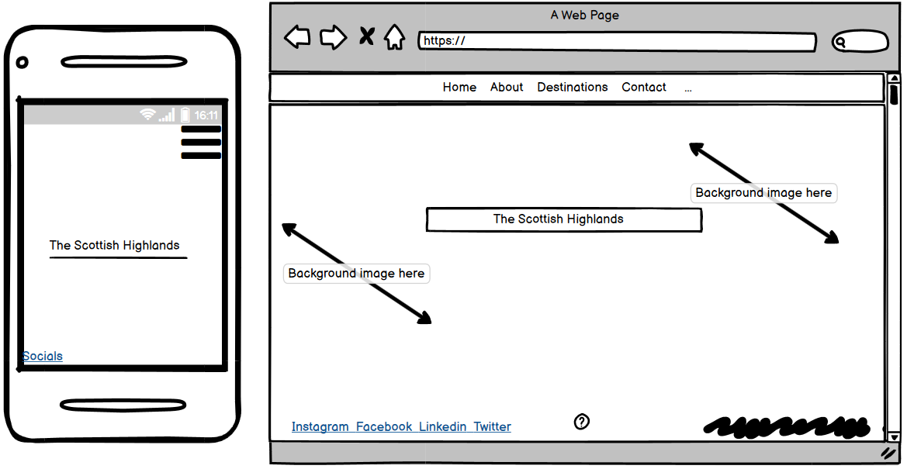
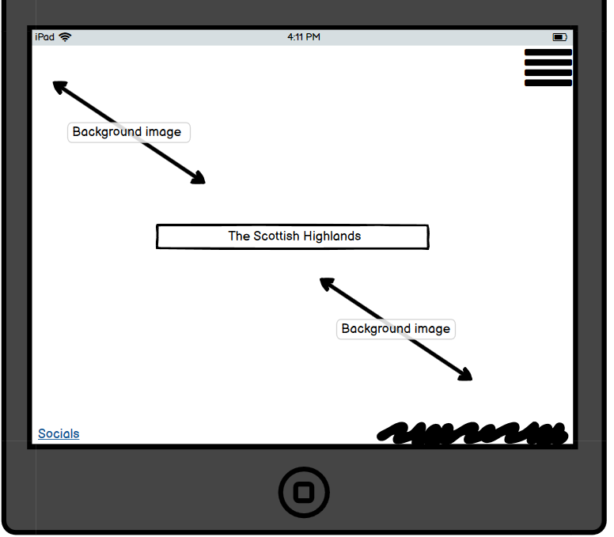

## Welcome 

This is the Readme for my Scottish Highlands website!
 I hope to provide all the necessary information and and answer any questions you may have.
 It is responsive on all devices, view the website here []

## User Experience (UX)
### User Stories
## First time user goals
a.  As a first I want to be able to get the information regarding what this site is about as soon as I enter.

b. As a first time user I want to be able to know what the site is about upon entering the home page.

c.  As a first time user I want to be able to contact the creators or view their socials to contact aswell.

## Returning user goals user goals
a. As a returning visitor I want to be able to easily contact someone through the site regarding the Scottish Highlands.

b.  As a returning visitor I want to find more information regarding the scottish highlands.

c.  As a returning visitor I want to be taken to a new page when I open a link and not taken off the current page I am on.

## Frequent user goals
a. As a frequent user I want to be view the destinations talked about on a map.

b. As a frequent user I want to be left with more knowledge on the The Highlands then before I visited.

c. As a frequent user I want to be able to be able to recive more information after contacting.

## Design 

### Typograpghy

- The Roboto is the main font present within this site and lato for h1 to h6 headers. I have sans serif as the fallback.

### Imagery 

- There is a a few pictures in this site the main is the one of the Scottish highlands as the home page, all images used throught are of the highlands to highlight its beauty.

### Colour Scheme

- The main colours used are a light blue for sections and a light grey for backgrounds, navbar is azure to contrast with the home page image. Added highlights to headers to add more interaction some change from azure to blue while some azure to yellow.Used a diffrent tone of blue for certain sections to make stand out.

## Wireframes

For the design of my wireframes I used Balsamic, You can find the link to the site here!   
I will also include screenshots below.

## Features

- The site is responsive and can be viewed on all viewports.

- Contains interactive elemnts and pop ups.

## Technologies used

### languages used
- Javascript
- CSS
- HTML
- Markdown

## Testing 
For my testing I used the W3C validator the html in my projectand for javascript I used Jsint and finally Jigsaw for my CSS. 

## To test my code I did it in the following way 

- I ran the code through the 3 diffrent validators for each of  my three languages.

i. I would copy sections of code so as not to do a whole page and fix any problems within the section first.

ii. Paste the code into the correct tester.

iii. Once results and errors (if present) are visble, examine and correct the changes needed.
  
iv. Repeated the same process for the three languages.

- I would browse through the site on the three diffrent types of view port to ensure it worked well.

i. I would browse through all of the site on the mobile and table.

ii. I check all the links to make sure they worked correctly, I looked at the text content to make sure it came out the way intended.

iii. I would then make sure that all the correct text is visble and not too small, then I would interact with all the interactive elements to make sure they reacted correctly.

iv.  Open google tools and view any errors present.

v. Correct the changes if needed.

- I also viewed the site on diffrent browsers to see how it reacted.

i. I would open up a diffrent browser wheter it be it mozilla,internet explorer or google.

ii. I would interact and click all the links available to make sure they worked.

iii. Interact with all interactive elements and code to make sure it ran they way its supposed to.

## changes made 
Upon testing the site a few changes had to be made the main one been that their was a scroll bar everytime the site was viewed on a Tablet or Mobile device , to fix this I added a "z-index: 100; " to the body styles of the site and the problem was solved.

## Testing user stories 

## First time user goals
A.   "As a first I want to be able to get the information regarding what this site is about as soon as I enter."

- Upon entering the site there is a header stated "The scottish highlands to greet you and let you know what you are reading about".

- There is a image of the Scottish highlands in the background to highlight that this site is about travel destinations upon entering the home page.

- There is a contact option in the nav-bar so the user could sign up or contact for even more information.

B.   "As a first time user I want to be able to know what the site is about upon entering the home page."

- I have added a preloader stating "Ready for a adventure" to excite the user and let them know that this is a "outdoor site" and that its not going to be a plian site.

- The background image of the mountains lets the user know this site is a travel site.

- The header stating the "Scottish highlands" lets the user know exactly what this site is about straight away.

- The title of the site is the Scottish Higlands and the nav-bar has all the correct headers to make the user know what this site is about.

C.  "As a first time user I want to be able to contact the creators or view their socials to contact aswell."

- There is a section in the navbar called contact which has a contact form the user can interact with to contact the makers.

- In this contact section there is also a sign up form the user can use to get in touch with the makers or to get new information every week.

- In the footer of the site there is a link to four socials of the maker.

## Returning user goals user goals
a.  "As a returning visitor I want to be able to interact with elements on the site."

- All headers on the site have the correct JS to change colour when the mouse has entered over them

- There is time and date buttons the user can interact with to get either the time or date.

- The Gallery Contact and Signup section all have interactive elements wether it be changing images or submitting a contact request or even signing up to  weekly newsletter.

b. "As a returning visitor I want to find more information regarding the scottish highlands."

- There is 4 links to sites after the destination section.

- All four links are not only include more information on the Scottish highlands but one includes more information on the poet I used for "Inversnaid"

- The about section contains much information on the scottish highlands and the destinations adds more light to six destinations in the highlands.

c.   "As a returning visitor I want to be taken to a new page when I open a link and not taken off the current page I am on."

- All links on the website take you to a new page.

- All have a target_blank to make sure the user does not loose the current page they are on.

#### Frequent user goals
a.  "As a frequent user I want to be able to know the correct date and time when on the site and feel confident submiiting my details"

- There is date and time buttons throughtout the website espicially the index.html to allow the user to view the time while viewing the website.

- There is a remember me option on the signup part incase the user wishes to use it.

- There is a terms and plocy attached to add a sense of security for the user when submitting their details.

b.  "As a frequent user I want to be left with more knowledge on the subject at hand then before I visited."

- The whole page is dedicated to the Scottish highlands and this is shown to the user from the opening of the site.

- There is about section dedicated to just the information regarding the Highlands and if the user feels he needs more I have included links to fout more sites inlcuding more information.

- I have included a poem by Gerard Manley Hopkins to highlight its beauty and appeal.

c. "As a frequent user I want to be able to be able to know my submission or request sent has been received.

- Upon entering the details in the contact form a thanks you page will pop up once submitted.

- The contact and sign up form both have required attributes to make sure the maker receives all the neccassary information to reply.

- The sign up form also has a thank you redirect page to let the user know their detials have been submitted.

## Bugs

https://8000-indigo-silkworm-vxiqsz0j.ws-eu08.gitpod.io/favicon.icon

<link rel="shortcut icon" href="#">

## Deployment
To deploy my Project to Github do it following these steps

1. Open up your Github and navigate to your repository.

2. Under the Repository section click settings.

3. Locate Git hub pages by scrolling down and underneath it click the drop-down menu to     select a folder for your publishing source.

4. Click save and locate the link under the same section and click into the site.

## Run code locally
To run my code locally follow these steps:
Log in to GitHub and locate the GitHub Repository

1. Under the repo name click Clone.

2. To clone a copy of the repo using HTTPS, copy the link under "Clone with HTTPS".

3. Using your IDE of choice open up your preferred terminal.

4. Navigate to your desired file location.

5. Copy the link and input it into your terminal to clone my project.

6.  You are Done!

7. You can get more of this information in more detail here: (https://docs.github.com/en/github/creating-cloning-and-archiving-repositories/cloning-a-repository)

## Credit

Fisrt I would like to thank my mentor Samantha for all the help and then the Code Institute! I have added links to all the relevant sites I adapted code from or used to aid in me the making of this site.

 ## BOOTSTRAP

https://getbootstrap.com/docs/5.0/getting-started/introduction/

-Used for the shadow of elements my nav-bar and boiler plate.

## W3C SCHOOLS

https://www.w3schools.com/default.asp

- used for inspiration on many aspects, adapted contact form from there site and signup form.
## JSHINT

https://jshint.com/

- Used to correct JS

## JIGSAW

https://jigsaw.w3.org/css-validator/

- Used to correct CSS.

## JQUERY

## Google fonts

https://fonts.google.com/specimen/Lato#glyphs

- Used for my Roboto and Lato fonts.

## GOOGLE IMAGES

https://www.google.com/search?q=image+scottish+highlands+free&rlz=1C1VDKB_enIE944IE944&tbm=isch&source=iu&ictx=1&fir=g30rp5vOLgkcHM%252CuH7jS_yEYCnGmM%252C_&vet=1&usg=AI4_-kQaux9s

- Used for my images in this site mainky for the Gallery.

## Pixabay

https://pixabay.com/images/search/the%20scottish%20highlands/

- Used for my images in this site mainky for the Gallery.

## FONT AWESOME

https://fontawesome.com/v5.15/icons?d=gallery&p=2

- used for Icons for socials in footer.

## WIKIPEDIA

https://en.wikipedia.org/wiki/Main_Page

- Used for information on my six destinations all info copied and adapted from wikipedia.

## HTML TESTER
 - Used to correct all my html code.

## CSS TRICKS
- Used for inspiartion on my whole site along with W3C Schools.